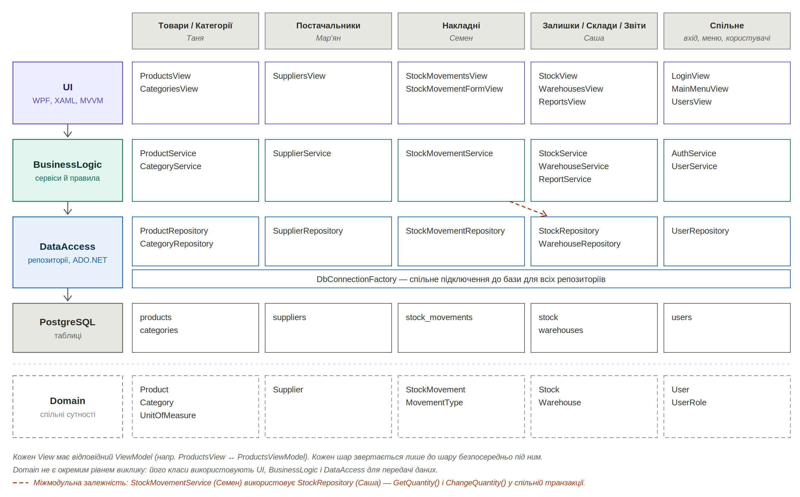
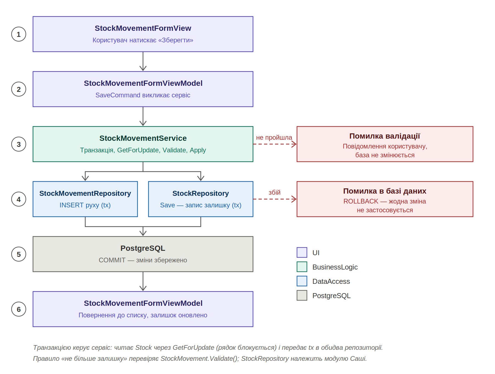
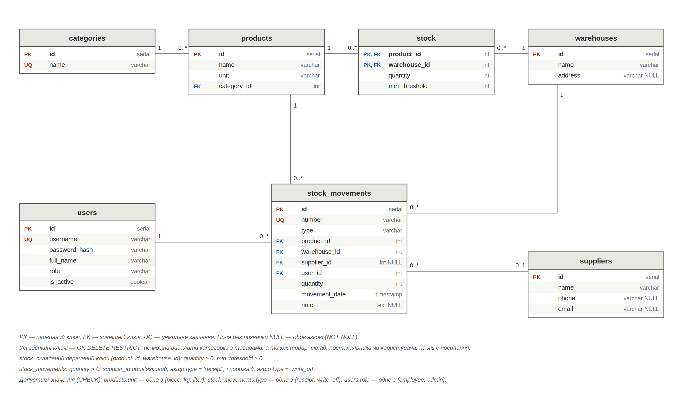

# Архітектура StockFlow

## 1. Архітектурний підхід

StockFlow побудовано за **шаровою (layered) архітектурою**. Застосунок поділено на шари, кожен з яких має чітку відповідальність і звертається лише до шару безпосередньо під ним:

**UI → BusinessLogic → DataAccess → PostgreSQL**

Окремо існує шар **Domain** — спільні класи-сутності, якими користуються всі три шари коду для передачі даних.

Усередині UI-шару використовується патерн **MVVM** (Model–View–ViewModel), стандартний для WPF: розмітка екрана (View, XAML) відокремлена від логіки відображення (ViewModel), а зв'язок між ними відбувається через data binding і команди.

Обґрунтування вибору наведено в розділі 6.

## 2. Структура рішення

```
/src
  StockFlow.Domain          — сутності (Product, Category, Supplier, Warehouse,
                              Stock, StockMovement, User) і переліки
  StockFlow.DataAccess      — репозиторії на ADO.NET, DbConnectionFactory
  StockFlow.BusinessLogic   — сервіси з бізнес-правилами та валідацією
  StockFlow.UI              — WPF-застосунок: Views (XAML) і ViewModels
/tests
  StockFlow.Tests           — автоматизовані тести (xUnit)
```

## 3. Основні компоненти та їх відповідальність



### UI (WPF, XAML, MVVM)

Екрани застосунку та їхні ViewModels. Кожен View має відповідний ViewModel (наприклад, `ProductsView` ↔ `ProductsViewModel`).

- **Відповідає за:** відображення даних, реакцію на дії користувача, показ повідомлень про помилки, приховування елементів відповідно до ролі.
- **Не містить:** SQL-запитів і бізнес-правил.

### BusinessLogic

Сервіси, згруповані за модулями: `ProductService`, `CategoryService`, `SupplierService`, `StockMovementService`, `StockService`, `WarehouseService`, `ReportService`, `AuthService`, `UserService`.

- **Відповідає за:** бізнес-правила та валідацію (обов'язкові поля, унікальність назви категорії, заборона списання понад залишок, перевірка ролі), керування транзакціями.
- **Не містить:** SQL-запитів і звернень до елементів інтерфейсу.

### DataAccess

Репозиторії на ADO.NET: `ProductRepository`, `CategoryRepository`, `SupplierRepository`, `StockMovementRepository`, `StockRepository`, `WarehouseRepository`, `UserRepository`, а також спільний `DbConnectionFactory`, через який усі репозиторії отримують підключення до бази.

- **Відповідає за:** читання й запис даних у PostgreSQL. Усі запити параметризовані.
- **Не містить:** бізнес-правил і повідомлень для користувача.

### PostgreSQL

Реляційна база даних із таблицями `products`, `categories`, `suppliers`, `warehouses`, `stock`, `stock_movements`, `users`.

### Domain

Класи-сутності (`Product`, `Category`, `Supplier`, `Warehouse`, `Stock`, `StockMovement`, `User`) і переліки (`UnitOfMeasure`, `MovementType`, `UserRole`). Не залежить від жодного іншого шару.

### Розподіл модулів у команді

| Модуль | Відповідальний |
|---|---|
| Товари / Категорії | Таня |
| Постачальники | Мар'ян |
| Накладні (рух товару) | Семен |
| Залишки / Склади / Звіти | Саша |
| Спільне: вхід, головне меню, користувачі | — |

## 4. Взаємодія компонентів

Нижче показано, як через шари проходить найважливіша дія системи — збереження накладної (руху товару).



1. Користувач заповнює форму в `StockMovementFormView` і натискає «Зберегти».
2. `StockMovementFormViewModel` через команду `SaveCommand` передає дані форми в `StockMovementService`.
3. `StockMovementService` перевіряє роль користувача й обов'язкові поля. Якщо перевірка не пройдена, користувач бачить повідомлення про помилку, а база даних не змінюється. Після успішної перевірки сервіс відкриває `IDbTransaction` і читає залишок через `StockRepository.GetForUpdate()`. Якщо запис існує, його рядок блокується до кінця транзакції.
4. `StockMovement.Validate(stock)` перевіряє достатність товару для `WriteOff`; для `Receipt` нестача товару не є причиною відмови. `StockMovement.Apply(stock)` змінює кількість в об'єкті `Stock`. Сервіс передає ту саму транзакцію в обидва репозиторії: `StockMovementRepository` додає запис руху товару, а `StockRepository.Save(stock)` зберігає залишок для пари (товар, склад). Репозиторії одне одного не викликають — транзакцією керує лише сервіс.
5. Якщо обидві операції успішні, транзакція фіксується (`COMMIT`). Якщо перевірка або будь-яка операція в транзакції завершується помилкою, усі зміни відкочуються (`ROLLBACK`).
6. Результат повертається у ViewModel: користувач повертається до списку накладних, а оновлений залишок одразу доступний у вікні «Залишки».

Ця схема забезпечує дві нефункціональні вимоги:

- **Надійність:** рух товару і залишок змінюються атомарно — разом або не змінюються взагалі.
- **Безпека:** SQL існує лише в шарі DataAccess і завжди параметризований.

Детальний перебіг надходження описано в [сценарії реєстрації надходження товару](scenarios.md#сценарій-реєстрація-надходження-товару).

### Міжмодульна залежність: Накладні → Залишки

`StockMovementService` (модуль «Накладні», Семен) використовує `StockRepository` (модуль «Залишки», Саша): у спільній транзакції отримує залишок через `GetForUpdate()`, перевіряє рух, змінює об'єкт `Stock` через `StockMovement.Apply(stock)` і передає його на збереження. Наявний рядок залишку блокується до завершення транзакції. На схемі шарів ця залежність позначена пунктирною стрілкою.

Щоб модулі інтегрувалися без переробок, `StockRepository` надає такий контракт:

| Метод | Призначення |
|---|---|
| `GetForUpdate(productId, warehouseId, transaction)` | Повертає `Stock` для пари (товар, склад) і блокує рядок до кінця транзакції (`SELECT ... FOR UPDATE`). Якщо запису ще немає, повертає новий `Stock` з кількістю 0 |
| `Save(stock, transaction)` | Зберігає залишок: створює рядок, якщо його не було, або оновлює наявний |

Зміни цього контракту узгоджуються між відповідальними за обидва модулі.

## 5. Модель даних



Ключові рішення моделі даних:

- **Залишки** зберігаються в `stock` для кожної пари (товар, склад). Там само зберігається мінімальна норма `min_threshold`, бо вона може відрізнятися для різних складів.
- **Накладна** — один запис у `stock_movements` (одна дія з одним товаром). Тип руху (`receipt` / `write_off`) — поле таблиці, а не окрема сутність. Постачальник вказується лише для надходження.
- **Ролі** — поле `role` у таблиці `users` (`employee` / `admin`). Окрема таблиця ролей не потрібна, бо ролей лише дві.
- **Одиниця виміру** — поле `unit` у `products` з фіксованим набором значень.
- **Видалення** обмежене на рівні бази: усі зовнішні ключі мають правило `ON DELETE RESTRICT`. Зокрема, категорію неможливо видалити, поки в ній є товари, а товар, склад, постачальника чи користувача — поки на них посилаються залишки або накладні. Так історія руху товару ніколи не втрачається.

## 6. Обґрунтування ключових рішень

### Шарова архітектура і MVVM

Шарову архітектуру обрано, бо вона:

- дозволяє кожному учаснику команди працювати над своїм модулем наскрізно (від таблиці до екрана), не заважаючи іншим;
- ізолює SQL в одному шарі, що спрощує захист від SQL-ін'єкцій;
- дає змогу тестувати бізнес-правила (наприклад, заборону списання понад залишок) автоматизованими тестами без запуску інтерфейсу.

MVVM у UI-шарі обрано, бо:

- ViewModel — звичайний клас без вікна, тож логіку екранів можна покрити тестами xUnit;
- видимість елементів залежно від ролі користувача задається властивістю ViewModel і прив'язується до інтерфейсу, а не прописується вручну в кожному вікні;
- бізнес-логіка не потрапляє в code-behind вікон, що зберігає межі між шарами.

### Правила залишку в сутностях і блокування рядка

Правило «не можна списати більше, ніж є на складі» реалізовано в сутності `StockMovement` (методи `Validate(stock)` і `Apply(stock)`), а не в SQL чи сервісі. Так його можна перевірити звичайним юніт-тестом без бази даних і заглушок, а стиль збігається з рештою сутностей (наприклад, `Stock.IsBelowThreshold()`).

Оскільки залишок спершу читається, а потім записується, двоє користувачів, які одночасно списують той самий товар, могли б обидва пройти перевірку і списати більше, ніж є. Щоб цього уникнути, `StockRepository.GetForUpdate()` читає рядок з `SELECT ... FOR UPDATE`: PostgreSQL блокує його до кінця транзакції, тож другий користувач чекає і читає вже оновлений залишок. Додатковою страховкою на рівні бази є обмеження `CHECK (quantity >= 0)` у таблиці `stock`.

### Об'єднання ролей Працівник і Власник

_Додає Мар'ян._

### ADO.NET замість Entity Framework

ADO.NET передбачено вимогами курсу. У межах навчального проєкту явні параметризовані SQL-запити допомагають побачити, як застосунок звертається до PostgreSQL і як контролюється доступ до даних. У шарі `DataAccess` підключення надає `DbConnectionFactory`, а репозиторії виконують запити; бізнес-правила залишаються в `BusinessLogic`, відображення даних — у WPF-інтерфейсі.

Для реєстрації руху товару `StockMovementService` керує спільною `IDbTransaction`: після `GetForUpdate()` і `StockMovement.Apply(stock)` репозиторії зберігають рух та змінений `Stock`. Якщо перевірка або запис у транзакції завершується помилкою, вона відкочується, тому рух і залишок не можуть бути збережені частково. Межа транзакції та послідовність дій залишаються явними в коді.

Entity Framework також підтримує транзакції та міг би зменшити обсяг коду для роботи з даними. Проте для поточного обсягу StockFlow команда обрала ADO.NET, щоб безпосередньо опрацювати SQL, параметри запитів і взаємодію з PostgreSQL. Недолік цього рішення — SQL-запити та перетворення рядків результату на об’єкти потрібно писати й підтримувати вручну.

### Спрощена модель накладної (один запис = одна дія)

У StockFlow один запис `StockMovement` відповідає одній дії над одним товаром: надходженню (`Receipt`) або списанню (`WriteOff`). Запис містить тип руху, товар, кількість, склад, дату й користувача, який виконав дію. Для надходження також зазначається постачальник. Тип руху є полем `StockMovement`, а не окремою сутністю, що відповідає прийнятій ER-моделі.

Для поточних вимог така структура простіша за модель «шапка накладної + рядки»: не потрібно створювати окремі сутності для документа та його позицій. Форма зберігає одну дію, а `StockMovementService` може перевірити її дані, записати рух і змінити залишок відповідного товару на складі в одній транзакції. Кожен рух також можна окремо переглянути й врахувати у звітах.

Обмеження моделі полягає в тому, що поставку з кількома товарами доведеться зареєструвати кількома записами `StockMovement`; ці записи не будуть об’єднані в одну накладну. Якщо в майбутньому з’явиться вимога оформлювати один документ із багатьма товарними позиціями, модель можна розширити сутністю накладної та пов’язаними з нею рядками.

### PostgreSQL як СУБД

_Додає Саша._